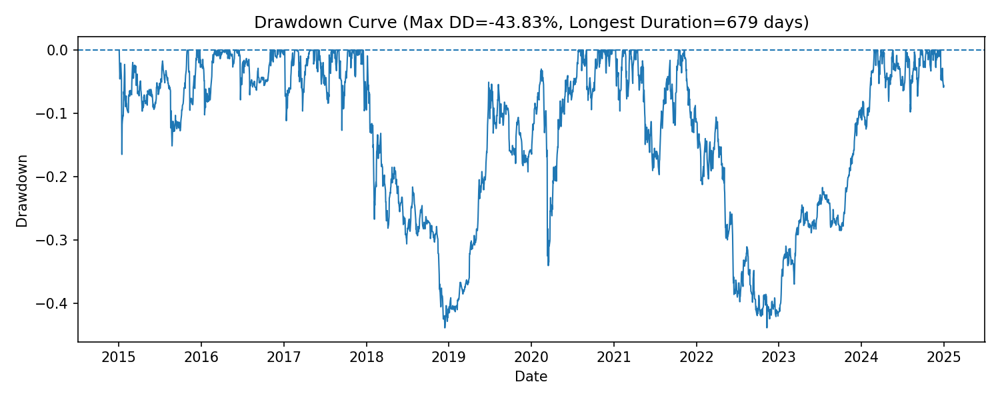

# Risk Analysis Toolkit

A Python toolkit for **market risk analysis** of portfolios.  
Includes **VaR (Value at Risk)** and **ES (Expected Shortfall)** under multiple methods, **backtesting** (Kupiec POF test), **drawdowns**, and **stress testing**.

> Built with NumPy, Pandas, SciPy, Matplotlib, and yfinance.  

---

## Features

- **Historical VaR & ES** (empirical quantiles of loss distribution)
- **Parametric Normal VaR & ES** (variance–covariance method)
- **Monte Carlo VaR & ES** (multivariate normal simulation)
- **VaR Backtesting** with Kupiec Proportion-of-Failures (POF) test
- **Drawdown curve** and maximum drawdown statistics
- **Stress Testing**  
  - Historical worst windows (1, 5, 10, 20-day cumulative losses)  
  - Hypothetical scenarios (e.g., −20% equity, −8% bonds, +5% gold)

---

## Installation

```bash
git clone https://github.com/<YOUR_USERNAME>/risk-analysis.git
cd risk-analysis
python -m venv .venv
source .venv/bin/activate   # Windows: .venv\Scripts\activate
pip install -r requirements.txt
```

Main dependencies:
```
numpy
pandas
matplotlib
scipy
yfinance
```

---

## Usage

### 1) Historical & Normal VaR/ES
```bash
python risk_analysis.py --prices data/prices.csv \
  --weights data/weights.csv --weights-col MaxSharpe_Weight \
  --alpha 0.95 --alpha-hi 0.99
```

### 2) Monte Carlo VaR/ES
```bash
python risk_analysis.py --prices data/prices.csv \
  --weights data/weights.csv --weights-col MaxSharpe_Weight \
  --alpha 0.99 --mc 100000
```

### 3) Weekly data
```bash
python risk_analysis.py --prices data/prices.csv --weekly
```

---

## Outputs

- `data/risk_report.csv` – summary of VaR/ES across methods  
- `data/var_backtest.csv` – rolling VaR estimates + breach indicators  
- `data/stress_historical.csv` – worst historical windows  
- `data/stress_hypothetical.csv` – hypothetical stress P&L  
- Figures saved in `figures/`:
  - `ret_hist_var.png` – histogram with VaR lines
  - `rolling_var_exceedances.png` – backtest chart with breaches
  - `drawdown_curve.png` – portfolio drawdowns

---

## Key Figures

**Return Distribution with VaR lines**  


**Rolling VaR & Exceptions**  


**Drawdown Curve**  


---

## Interpreting Results

- **VaR (Value at Risk):** cutoff loss at a confidence level.  
  Example: 1-day 95% VaR = −3% → losses worse than −3% occur 5% of the time.  

- **ES (Expected Shortfall):** average loss **beyond** VaR in the tail.  
  Better for capital planning and now preferred under Basel III/IV.  

- **Kupiec Test:** checks if the observed breach rate matches the expected α-tail frequency.  
  - Too many breaches → model underestimates risk.  
  - Too few breaches → overly conservative.  

- **Drawdown:** peak-to-trough decline, shows investor pain in wealth terms.  

- **Stress Tests:** “what if” scenarios, either replaying past worst periods or applying fixed shocks.

